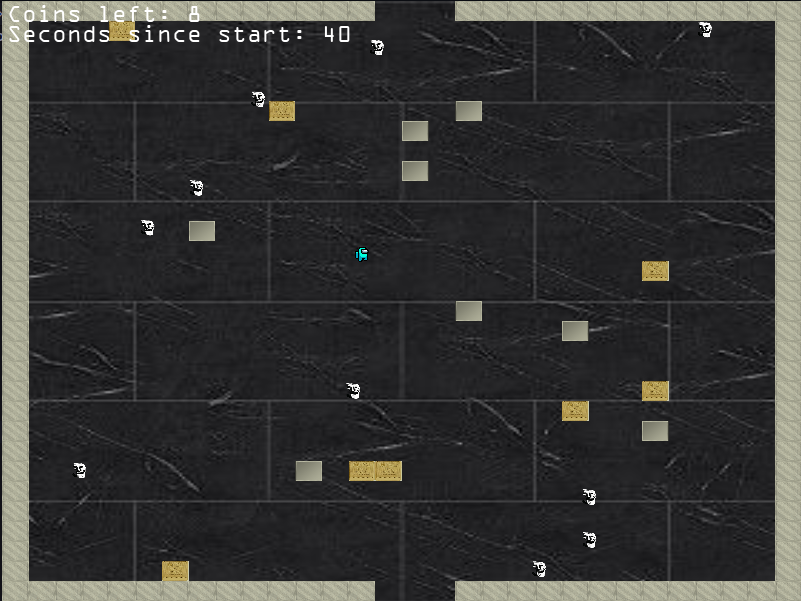

# Trollface Dungeon

<p align="center">

</p>

A small, frightened Amogus is trapped in a dark dungeon swarming with angry Trollfaces who are out to kill him. The responsibility is yours to lead the Amogus to safety, evading all the Trollfaces. The problem is, you can only exit the dungeon if you collect all the coins lying around. Can you do it?

## Rules

The dungeon consists of 3 levels, each harder than the previous one. Each level contains 4 outer walls with one sole exit, randomly generated inner walls and coins, and enemies that spawn in random positions. As you progress through the levels, the number of walls and enemies increases, making the game harder. You must collect all the coins to move to the next level, and if you come into contact with an enemy, you will die, and the game will be over. If you successfully manage to complete all 3 levels, the Amogus will be saved and you will win the game.

You have an option to toggle the lights on and off. The lights are on by default, but if they are off, you will only be able to see walls, enemies and coins in a 1-unit radius. However, the coins are worth twice as much in the dark.

## Controls

<kbd>W</kbd> - Move up<br>
<kbd>A</kbd> - Move left<br>
<kbd>S</kbd> - Move down<br>
<kbd>D</kbd> - Move right<br>
<kbd>Esc</kbd> - Quit<br>
<kbd>SPACE</kbd> - Toggle lights on and off<br>

## Setup

1. Clone the repository.

2. For convenience, a script has been provided to install the dependencies, compile the game and run it.
```bash
cd Trollface-Dungeon
./run.sh
```
The script can be run each time to run the game.
